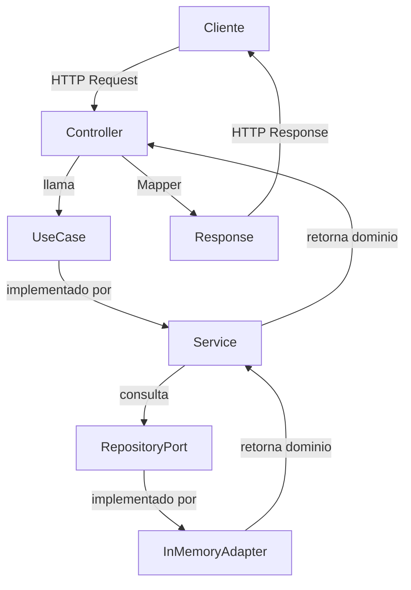
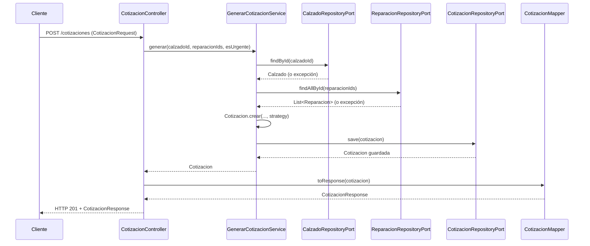

# Design Document — Cotizador de Reparación de Calzado

## Overview

El **Cotizador de Reparación de Calzado** es un backend REST construido con Spring Boot que sigue una arquitectura hexagonal (ports & adapters). Su propósito es permitir a un cliente consultar tipos de calzado y reparaciones disponibles, y a partir de esa selección generar una cotización que incluya subtotal, recargo por urgencia (cuando aplica) y tiempo estimado de entrega.

La persistencia es en memoria para esta versión. No se contempla autenticación, pagos ni base de datos persistente.

---

## Architecture

### Capas hexagonales

Las dependencias de código fuente fluyen siempre **hacia el dominio** (y desde `service` hacia `port.in`). La capa `service` implementa `port.in` y usa `port.out`; nunca al revés.

```
┌──────────────────────────────────────────────────────────────────┐
│  infrastructure                                                  │
│  ┌─────────────────────────┐  ┌────────────────────────────────┐ │
│  │  adapter.in.rest        │  │  adapter.out.persistence       │ │
│  │  (Controllers, DTOs,    │  │  (InMemory*Adapter)            │ │
│  │   Mappers)              │  │                                │ │
│  └────────────┬────────────┘  └───────────────┬────────────────┘ │
└───────────────│───────────────────────────────│──────────────────┘
                │                               │
                ▼                               ▼
┌──────────────────────────────────────────────────────────────────┐
│  application                                                     │
│  ┌────────────────────────────────────────────────────────────┐  │
│  │  service (*Service)                                        │  │
│  │  Implementa port.in. Inyecta port.out por constructor.     │  │
│  └───────┬──────────────────────────────────────┬─────────────┘  │
│          │ implements                           │ uses           │
│          ▼                                     ▼                 │
│  ┌──────────────────────┐  ┌──────────────────────────────────┐  │
│  │  port.in             │  │  port.out                        │  │
│  │  (*UseCase)          │  │  (*RepositoryPort)               │  │
│  └──────────────────────┘  └──────────────────────────────────┘  │
└─────────────────────────────┬────────────────────────────────────┘
                              │
                              ▼
┌──────────────────────────────────────────────────────────────────┐
│  domain                                                          │
│  (Cotizacion, Calzado, Reparacion, UrgencyPricingStrategy,       │
│   excepciones de negocio)                                        │
│  Sin Spring. Sin JPA.                                            │
└──────────────────────────────────────────────────────────────────┘
```

### Diagrama de flujo general (Mermaid)

> **Nota:** Este diagrama representa el flujo de llamadas en tiempo de ejecución (quién invoca a quién), **no** la dirección de las dependencias arquitectónicas en el código fuente. En el código, `service` depende de `port.in` (lo implementa) y de `port.out` (lo inyecta por constructor); `infrastructure` depende de `application`, nunca al revés.



---

## Components and Interfaces

### Capa `domain` — `com.tallerdae.cotizador.domain`

| Clase / Interfaz | Responsabilidad |
|---|---|
| `Cotizacion` | Entidad principal. Contiene el resultado de la cotización. Expone el factory method estático `Cotizacion.crear(...)` que valida RN-04 y RN-05. Sin constructor público directo. |
| `Calzado` | Value Object. Representa un tipo de calzado con su factor de complejidad. |
| `Reparacion` | Value Object. Representa un servicio de reparación con precio base y tiempo estimado. |
| `UrgencyPricingStrategy` | Interfaz Strategy. Define el contrato para calcular recargo y tiempo según nivel de urgencia. |
| `UrgentPricingStrategy` | Implementación concreta para `Servicio_Urgente = true`. Aplica RN-02 y RN-03. |
| `NonUrgentPricingStrategy` | Implementación concreta para `Servicio_Urgente = false`. Recargo = 0, tiempo = max sin reducir. |
| `CotizacionNotFoundException` | Excepción de negocio: cotización no encontrada. |
| `CalzadoNotFoundException` | Excepción de negocio: calzado no encontrado (error 404). |
| `ReparacionNotFoundException` | Excepción de negocio: una o más reparaciones no encontradas. |
| `ReparacionesVaciasException` | Excepción de negocio: lista de reparaciones vacía o ausente (RN-04). |

### Capa `application` — `com.tallerdae.cotizador.application`

#### Puertos de entrada (`port.in`)

| Interfaz | Responsabilidad |
|---|---|
| `GenerarCotizacionUseCase` | Contrato para generar una cotización a partir de un calzado, lista de reparaciones y flag de urgencia. |
| `ListarCalzadosUseCase` | Contrato para retornar todos los tipos de calzado disponibles. |
| `ListarReparacionesUseCase` | Contrato para retornar todas las reparaciones disponibles. |

#### Puertos de salida (`port.out`)

| Interfaz | Responsabilidad |
|---|---|
| `CalzadoRepositoryPort` | Contrato de persistencia para `Calzado`: `findAll()`, `findById(UUID)`. |
| `ReparacionRepositoryPort` | Contrato de persistencia para `Reparacion`: `findAll()`, `findAllById(List<UUID>)`, `findById(UUID)`. |
| `CotizacionRepositoryPort` | Contrato de persistencia para `Cotizacion`: `save(Cotizacion)`, `findById(UUID)`, `findAll()`. |

#### Servicios (`service`)

| Clase | Implementa | Inyecta |
|---|---|---|
| `GenerarCotizacionService` | `GenerarCotizacionUseCase` | `CalzadoRepositoryPort`, `ReparacionRepositoryPort`, `CotizacionRepositoryPort` |
| `ListarCalzadosService` | `ListarCalzadosUseCase` | `CalzadoRepositoryPort` |
| `ListarReparacionesService` | `ListarReparacionesUseCase` | `ReparacionRepositoryPort` |

Todos los servicios reciben sus dependencias exclusivamente por constructor. No instancian adaptadores directamente.

### Capa `infrastructure` — `com.tallerdae.cotizador.infrastructure`

#### Adaptadores de entrada REST (`adapter.in.rest`)

| Clase | Responsabilidad |
|---|---|
| `CotizacionController` | Expone `POST /cotizaciones`. Delega en `GenerarCotizacionUseCase`. |
| `CalzadoController` | Expone `GET /calzados`. Delega en `ListarCalzadosUseCase`. |
| `ReparacionController` | Expone `GET /reparaciones`. Delega en `ListarReparacionesUseCase`. |
| `CotizacionRequest` | DTO de entrada para generación de cotización. |
| `CotizacionResponse` | DTO de salida con todos los campos de la cotización. |
| `CalzadoResponse` | DTO de salida con los campos de un tipo de calzado. |
| `ReparacionResponse` | DTO de salida con los campos de una reparación. |
| `CotizacionMapper` | Único punto de conversión entre `Cotizacion` (dominio) y DTOs. |

#### Adaptadores de salida en memoria (`adapter.out.persistence`)

| Clase | Implementa |
|---|---|
| `InMemoryCalzadoRepositoryAdapter` | `CalzadoRepositoryPort` |
| `InMemoryReparacionRepositoryAdapter` | `ReparacionRepositoryPort` |
| `InMemoryCotizacionRepositoryAdapter` | `CotizacionRepositoryPort` |

Cada adaptador mantiene un `Map<UUID, T>` en memoria e inicializa datos de ejemplo en el constructor o en un método `@PostConstruct`.

#### Configuración Spring (`config`)

| Clase | Responsabilidad |
|---|---|
| `CotizadorConfiguration` | Clase `@Configuration`. Declara los beans de servicios inyectando los puertos por constructor. Es el único lugar donde ocurre el wiring entre servicios y adaptadores. |

---

## Data Models

### Entidad `Cotizacion`

```
Cotizacion
├── id                : UUID         (generado en Cotizacion.crear)
├── fechaCreacion     : LocalDateTime (asignada en Cotizacion.crear)
├── calzado           : Calzado
├── reparaciones      : List<Reparacion>
├── esUrgente         : boolean
├── subtotal          : BigDecimal
├── recargoUrgencia   : BigDecimal
├── total             : BigDecimal
└── tiempoEstimadoDias: int
```

**Factory method `Cotizacion.crear(...)`**:

```java
// Firma conceptual (sin anotaciones de framework)
public static Cotizacion crear(
    Calzado calzado,
    List<Reparacion> reparaciones,
    boolean esUrgente,
    UrgencyPricingStrategy strategy
)
```

Responsabilidades del factory:
1. Valida que `reparaciones` no sea nula ni vacía → lanza `ReparacionesVaciasException` (RN-04).
2. Genera el UUID y la fecha de creación (RN-05).
3. Calcula el `subtotal` aplicando RN-01.
4. Delega en `strategy` el cálculo de `recargoUrgencia`, `total` y `tiempoEstimadoDias`.
5. Construye y retorna la instancia validada.

### Value Object `Calzado`

```
Calzado
├── id                : UUID
├── nombre            : String
└── factorComplejidad : BigDecimal  (> 0)
```

### Value Object `Reparacion`

```
Reparacion
├── id                  : UUID
├── nombre              : String
├── precioBase          : BigDecimal  (> 0)
└── tiempoEstimadoDias  : int         (>= 1)
```

### Interfaz `UrgencyPricingStrategy`

```java
public interface UrgencyPricingStrategy {
    BigDecimal calcularRecargo(BigDecimal subtotal);
    BigDecimal calcularTotal(BigDecimal subtotal, BigDecimal recargo);
    int calcularTiempoEntrega(List<Reparacion> reparaciones);
}
```

#### `NonUrgentPricingStrategy`

- `calcularRecargo(subtotal)` → `BigDecimal.ZERO`
- `calcularTotal(subtotal, recargo)` → `subtotal`
- `calcularTiempoEntrega(reparaciones)` → `max(reparacion.tiempoEstimadoDias)`

#### `UrgentPricingStrategy`

- `calcularRecargo(subtotal)` → `subtotal × 0.30` (RN-02)
- `calcularTotal(subtotal, recargo)` → `subtotal + recargo` (RN-02)
- `calcularTiempoEntrega(reparaciones)` → `max(ceil(max_dias / 2), 1)` (RN-03)

---

## Use Case Flows

### CU-01: Listar tipos de calzado

```
CalzadoController
  → llama ListarCalzadosUseCase.listar()
      → ListarCalzadosService
          → CalzadoRepositoryPort.findAll()
              → InMemoryCalzadoRepositoryAdapter retorna List<Calzado>
          ← List<Calzado>
      ← List<Calzado>
  → CotizacionMapper (o mapper equivalente) convierte a List<CalzadoResponse>
← HTTP 200 + List<CalzadoResponse>
```

### CU-02: Listar reparaciones disponibles

```
ReparacionController
  → llama ListarReparacionesUseCase.listar()
      → ListarReparacionesService
          → ReparacionRepositoryPort.findAll()
              → InMemoryReparacionRepositoryAdapter retorna List<Reparacion>
          ← List<Reparacion>
      ← List<Reparacion>
  → mapper convierte a List<ReparacionResponse>
← HTTP 200 + List<ReparacionResponse>
```

### CU-03: Generar cotización

```
CotizacionController
  → recibe CotizacionRequest
  → CotizacionMapper.toDomain(request) no aplica directamente; pasa IDs al UseCase
  → llama GenerarCotizacionUseCase.generar(calzadoId, reparacionIds, esUrgente)
      → GenerarCotizacionService
          1. CalzadoRepositoryPort.findById(calzadoId)
             → lanza CalzadoNotFoundException si no existe
          2. ReparacionRepositoryPort.findAllById(reparacionIds)
             → lanza ReparacionNotFoundException si alguno no existe
          3. Selecciona strategy: UrgentPricingStrategy | NonUrgentPricingStrategy
          4. Cotizacion.crear(calzado, reparaciones, esUrgente, strategy)
             → valida RN-04 (lista no vacía)
             → calcula subtotal (RN-01)
             → strategy.calcularRecargo / calcularTotal / calcularTiempoEntrega
             → asigna UUID y fechaCreacion (RN-05)
          5. CotizacionRepositoryPort.save(cotizacion)
          ← Cotizacion
      ← Cotizacion
  → CotizacionMapper.toResponse(cotizacion) → CotizacionResponse
← HTTP 201 + CotizacionResponse
```

### Diagrama de secuencia CU-03 (Mermaid)



---

## API REST

### `GET /calzados`

Retorna todos los tipos de calzado disponibles.

**Response 200 OK**
```json
[
  {
    "id": "uuid-1",
    "nombre": "Zapatilla Deportiva",
    "factorComplejidad": 1.2
  },
  {
    "id": "uuid-2",
    "nombre": "Bota de Cuero",
    "factorComplejidad": 1.5
  }
]
```

---

### `GET /reparaciones`

Retorna todas las reparaciones disponibles.

**Response 200 OK**
```json
[
  {
    "id": "uuid-a",
    "nombre": "Cambio de Suela",
    "precioBase": 25.00,
    "tiempoEstimadoDias": 3
  },
  {
    "id": "uuid-b",
    "nombre": "Costura Lateral",
    "precioBase": 15.00,
    "tiempoEstimadoDias": 2
  }
]
```

---

### `POST /cotizaciones`

Genera una cotización estimada.

**Request Body**
```json
{
  "calzadoId": "uuid-1",
  "reparacionIds": ["uuid-a", "uuid-b"],
  "esUrgente": false
}
```

**Response 201 Created**
```json
{
  "id": "uuid-cotizacion",
  "fechaCreacion": "2025-01-15T10:30:00",
  "subtotal": 48.00,
  "recargoUrgencia": 0.00,
  "total": 48.00,
  "tiempoEstimadoDias": 3
}
```

**Response 201 Created (con urgencia)**
```json
{
  "id": "uuid-cotizacion",
  "fechaCreacion": "2025-01-15T10:30:00",
  "subtotal": 48.00,
  "recargoUrgencia": 14.40,
  "total": 62.40,
  "tiempoEstimadoDias": 2
}
```

**Errores**

| HTTP | Situación | Mensaje ejemplo |
|---|---|---|
| 400 | Lista de reparaciones vacía o ausente | `"Se requiere al menos una reparación"` |
| 404 | Calzado no encontrado | `"Tipo de calzado no encontrado: {id}"` |
| 404 | Reparación no encontrada | `"Reparación no encontrada: {id}"` |

---

## Correctness Properties

*Una propiedad es una característica o comportamiento que debe cumplirse en todas las ejecuciones válidas del sistema. Las propiedades actúan como puente entre las especificaciones legibles por humanos y las garantías de corrección verificables automáticamente.*

### Property 1: Estructura completa de Calzado retornado

*Para cualquier* conjunto de objetos `Calzado` almacenados en el repositorio en memoria, al consultar la lista de calzados, cada elemento retornado debe incluir un `id` no nulo, un `nombre` no nulo y un `factorComplejidad` mayor a cero.

**Validates: Requirements 1.2**

---

### Property 2: Estructura completa de Reparacion retornada

*Para cualquier* conjunto de objetos `Reparacion` almacenados en el repositorio en memoria, al consultar la lista de reparaciones, cada elemento retornado debe incluir un `id` no nulo, un `nombre` no nulo, un `precioBase` mayor a cero y un `tiempoEstimadoDias` mayor o igual a uno.

**Validates: Requirements 2.2**

---

### Property 3: Cálculo correcto del Subtotal (RN-01)

*Para cualquier* objeto `Calzado` con `factorComplejidad > 0` y cualquier lista no vacía de `Reparacion` con `precioBase > 0`, el `subtotal` calculado en la cotización debe ser exactamente igual a la suma de `(precioBase_i × factorComplejidad)` para cada reparación `i`.

**Validates: Requirements 3.1**

---

### Property 4: Cotización no urgente no aplica recargo (RN-01, RN-02)

*Para cualquier* cotización generada con `esUrgente = false`, el `recargoUrgencia` debe ser exactamente cero y el `total` debe ser igual al `subtotal`.

**Validates: Requirements 3.2**

---

### Property 5: Tiempo estimado no urgente es el máximo (RN-03)

*Para cualquier* lista de reparaciones con tiempos variados y una cotización generada con `esUrgente = false`, el `tiempoEstimadoDias` de la cotización debe ser igual al máximo de los `tiempoEstimadoDias` individuales de las reparaciones seleccionadas.

**Validates: Requirements 3.3**

---

### Property 6: Unicidad de identificadores de Cotizacion (RN-05)

*Para cualquier* conjunto de cotizaciones generadas a partir de entradas válidas, cada cotización debe tener un `id` único (UUID no nulo) y una `fechaCreacion` no nula. Ningún par de cotizaciones distintas debe compartir el mismo `id`.

**Validates: Requirements 3.4**

---

### Property 7: Rechazo de cotización con reparaciones vacías (RN-04)

*Para cualquier* solicitud de cotización con una lista de reparaciones nula o vacía, el factory method `Cotizacion.crear(...)` debe lanzar `ReparacionesVaciasException` y no debe crearse ninguna cotización.

**Validates: Requirements 3.6**

---

### Property 8: Rechazo de calzado o reparación inexistente

*Para cualquier* UUID que no corresponda a un `Calzado` registrado en el repositorio, el servicio debe lanzar `CalzadoNotFoundException`. Análogamente, *para cualquier* lista de IDs de reparaciones que contenga al menos un ID no registrado, el servicio debe lanzar `ReparacionNotFoundException` identificando el ID inválido.

**Validates: Requirements 3.7, 3.8**

---

### Property 9: Cotización urgente — recargo e invariante total (RN-02)

*Para cualquier* subtotal positivo en una cotización con `esUrgente = true`, el `recargoUrgencia` debe ser igual a `subtotal × 0.30` y el `total` debe ser igual a `subtotal + recargoUrgencia`.

**Validates: Requirements 4.1, 4.2**

---

### Property 10: Cotización urgente — tiempo reducido con mínimo de 1 día (RN-03)

*Para cualquier* lista de reparaciones con `tiempoEstimadoDias >= 1` y una cotización con `esUrgente = true`, el `tiempoEstimadoDias` resultante debe ser igual a `max(⌈max_dias / 2⌉, 1)`, es decir, el techo de la mitad del máximo, con mínimo garantizado de 1 día.

**Validates: Requirements 4.3, 4.4**

---

## Error Handling

### Estrategia general

Los servicios de aplicación lanzan excepciones de negocio definidas en `domain`. Un `@RestControllerAdvice` en `infrastructure` las intercepta y traduce a respuestas HTTP estructuradas.

### Mapa de excepciones → HTTP

| Excepción (`domain`) | Código HTTP | Campo `message` |
|---|---|---|
| `ReparacionesVaciasException` | 400 Bad Request | `"Se requiere al menos una reparación"` |
| `CalzadoNotFoundException` | 404 Not Found | `"Tipo de calzado no encontrado: {id}"` |
| `ReparacionNotFoundException` | 404 Not Found | `"Reparación no encontrada: {id}"` |
| `CotizacionNotFoundException` | 404 Not Found | `"Cotización no encontrada: {id}"` |
| Cualquier excepción no controlada | 500 Internal Server Error | `"Error interno del servidor"` |

### Formato de respuesta de error

```json
{
  "timestamp": "2025-01-15T10:30:00",
  "status": 400,
  "error": "Bad Request",
  "message": "Se requiere al menos una reparación",
  "path": "/cotizaciones"
}
```

### Decisiones de diseño

- Las excepciones de negocio residen en `domain` para que el servicio pueda lanzarlas sin depender de `infrastructure`.
- El `@RestControllerAdvice` vive en `infrastructure.adapter.in.rest` y es el único componente que conoce los códigos HTTP.
- `BigDecimal` con escala fija (2 decimales, `HALF_UP`) se usa en todos los cálculos monetarios para evitar errores de punto flotante.

---

## Testing Strategy

### Enfoque dual: pruebas unitarias + property-based testing (PBT)

El proyecto emplea un enfoque complementario:
- **Pruebas unitarias**: verifican ejemplos concretos, casos de borde y condiciones de error.
- **Pruebas de propiedad (PBT)**: verifican invariantes universales sobre amplios espacios de entrada.

### Biblioteca PBT

Se utilizará **[jqwik](https://jqwik.net/)** como biblioteca de property-based testing para Java, que se integra de forma nativa con JUnit 5. Cada prueba de propiedad ejecutará un mínimo de **100 iteraciones** por defecto.

Dependencia Maven:
```xml
<dependency>
    <groupId>net.jqwik</groupId>
    <artifactId>jqwik</artifactId>
    <version>1.8.x</version>
    <scope>test</scope>
</dependency>
```

### Pruebas unitarias por capa

#### `domain`

- `Cotizacion.crear(...)` — verificar que lanza `ReparacionesVaciasException` con lista vacía/nula.
- `Cotizacion.crear(...)` — verificar UUID y `fechaCreacion` no nulos con entrada válida.
- `UrgentPricingStrategy` — calcular recargo con valores decimales concretos.
- `NonUrgentPricingStrategy` — verificar que recargo = 0 y tiempo = max.

#### `application`

- `GenerarCotizacionService` — verificar flujo nominal con mocks de los tres `RepositoryPort`.
- `GenerarCotizacionService` — verificar que lanza `CalzadoNotFoundException` si el repositorio no encuentra el ID.
- `GenerarCotizacionService` — verificar que lanza `ReparacionNotFoundException` si alguna reparación no existe.
- `ListarCalzadosService` y `ListarReparacionesService` — verificar delegación al repositorio.

#### `infrastructure`

- `CotizacionMapper` — conversión de dominio a DTO y viceversa con ejemplos concretos.
- `CotizacionController` — verificar paths, métodos HTTP y códigos de respuesta (con `@WebMvcTest`).
- `GlobalExceptionHandler` (`@RestControllerAdvice`) — verificar que cada excepción de negocio produce el código HTTP correcto.
- `InMemory*Adapter` — verificar que `save` y `findById` funcionan correctamente en memoria.

### Pruebas de propiedad (jqwik)

Cada propiedad del documento de diseño se implementa como una prueba `@Property` en jqwik. El tag de referencia se indica como comentario JavaDoc sobre cada método.

| Test de propiedad | Propiedad que valida | Tag |
|---|---|---|
| `calzadoRetornadoTieneEstructuraCompleta` | Property 1 | `Feature: cotizador-reparacion-calzado, Property 1` |
| `reparacionRetornadaTieneEstructuraCompleta` | Property 2 | `Feature: cotizador-reparacion-calzado, Property 2` |
| `subtotalEsSumaProductos` | Property 3 | `Feature: cotizador-reparacion-calzado, Property 3` |
| `cotizacionNoUrgenteRecargoEsCero` | Property 4 | `Feature: cotizador-reparacion-calzado, Property 4` |
| `tiempoNoUrgenteEsMaximo` | Property 5 | `Feature: cotizador-reparacion-calzado, Property 5` |
| `cadaCotizacionTieneIdUnico` | Property 6 | `Feature: cotizador-reparacion-calzado, Property 6` |
| `listaVaciaLanzaExcepcion` | Property 7 | `Feature: cotizador-reparacion-calzado, Property 7` |
| `idInexistenteLanzaExcepcion` | Property 8 | `Feature: cotizador-reparacion-calzado, Property 8` |
| `cotizacionUrgenteRecargoEsTreintaPorciento` | Property 9 | `Feature: cotizador-reparacion-calzado, Property 9` |
| `tiempoUrgenteEsTechoMitadConMinimo` | Property 10 | `Feature: cotizador-reparacion-calzado, Property 10` |

### Cobertura mínima esperada

- Lógica de dominio (`domain`): 100 % de ramas en `Cotizacion.crear` y ambas estrategias.
- Servicios de aplicación (`application.service`): 90 % de líneas.
- Adaptadores REST e infraestructura: cubiertos por pruebas de integración con `@SpringBootTest` o `@WebMvcTest`.
